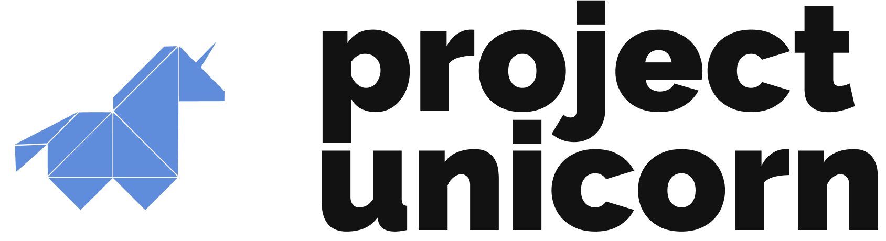

<p align="center">
  
</p>

<p align="center">
  <a href="https://travis-ci.com/projectunic0rn/pub">
    
  </a>

  <a href="https://projectunicorn.net/">
    
  </a>
</p>

<br />

## Quick start

```bash
# develop
npm run dev

# build
npm run build
```

## Documentation

- [Contributing Guide](https://projectunicorn.net/blog/tag/contributing/)
- [Attribution Notice](NOTICE)

## License

Copyright 2019 Project Unicorn

This project is licensed under the terms of the MIT License.
